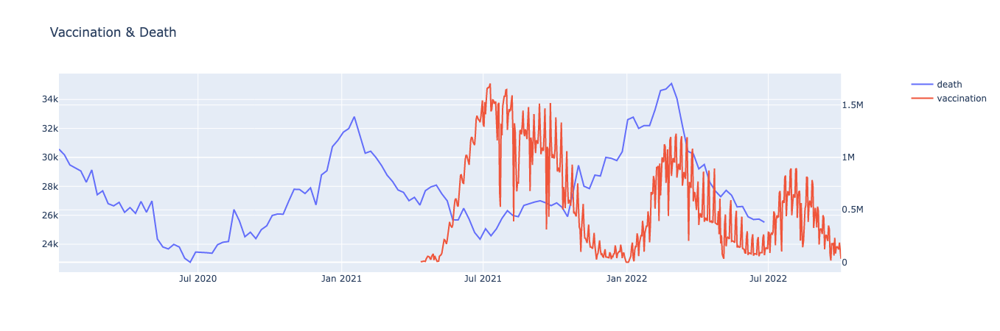

# Covid-19 Analysis

## Run

```
python -m venv venv
source venv/bin/activate
pip install -r requirements.txt
python visualize.py
```



## Data

1. [新型コロナワクチンの接種状況](https://info.vrs.digital.go.jp/dashboard): data/prefecture.ndjson
1. [日本の超過および過少死亡数ダッシュボード](https://exdeaths-japan.org/graph/weekly/): data/exdeath-japan-observed.csv


## Reference
1. https://plotly.com/python/figure-structure/
1.
