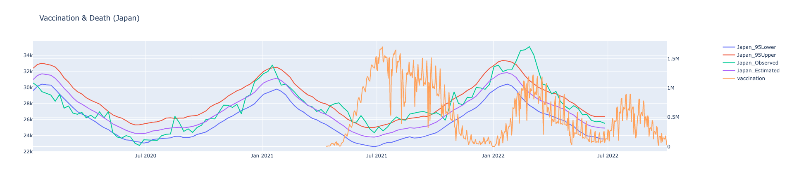

# Covid-19 Analysis

## Run

```
python -m venv venv
source venv/bin/activate
pip install -r requirements.txt
python visualize.py
```



## Data

1. [新型コロナワクチンの接種状況](https://info.vrs.digital.go.jp/dashboard): data/prefecture.ndjson
1. [日本の超過および過少死亡数ダッシュボード](https://exdeaths-japan.org/graph/weekly/):
    1. 観測死亡者数: data/exdeath-japan-observed.csv
    1. 予測死亡者数: data/exdeath-japan-estimates.csv
    1. 都道府県マスター: data/prefecture_master.csv
        ```
        cat data/exdeath-japan-observed.csv| cut -f1,2,3 -d, | sort -n| uniq > data/prefecture_master.csv
        ```
1. [日本の超過及び過小死亡数ダッシュボード (死因別死亡数)](https://exdeaths-japan.org/graph/weekly_cause): data/exdeath-japan-cause
1. [人口動態調査](https://www.e-stat.go.jp/stat-search/files?page=1&toukei=00450011&tstat=000001028897&cycle=1&year=20220&tclass1=000001053058&tclass2=000001053060&cycle_facet=tclass1%3Atclass2%3Acycle&tclass3val=0)
1. [人口動態統計速報(令和４年７月分)](https://www.mhlw.go.jp/toukei/saikin/hw/jinkou/geppo/s2022/dl/202207.pdf)
## Reference
1. https://plotly.com/python/figure-structure/
1. https://dash.plotly.com/basic-callbacks
